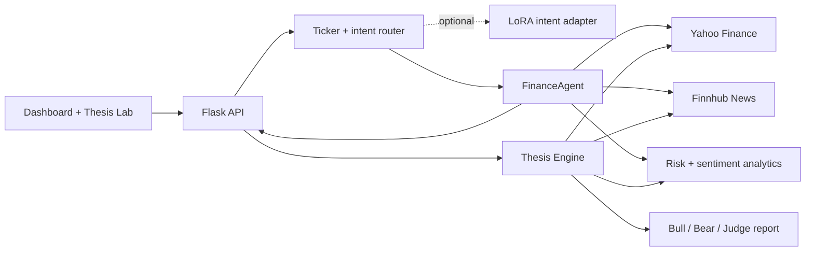

# Finance Intelligence Agent

A portfolio-ready Python project that challenges investment ideas instead of simply agreeing with them. It turns natural-language stock questions and investment theses into transparent bull cases, bear cases, risk metrics, and confidence-scored judgments.

> Educational research tool only — not financial advice.

## Why this project

The original prototype was developed in Google Colab as an 86-cell notebook. This repository refactors that experiment into a testable Python package with explicit provider boundaries, credential-safe configuration, an offline demo notebook, a CLI, and a small REST API.

## Features

- Natural-language intent and ticker extraction
- Current-price and previous-close comparison
- Six-month trend, annualized volatility, and maximum drawdown
- Multi-stock risk comparison
- Finnhub company-news retrieval with relevance filtering
- Explainable lexicon sentiment baseline
- Swappable data providers for testing and future model integrations
- CLI and Flask API entry points
- Responsive browser dashboard with a six-month price chart
- Browser-persisted watchlist and natural-language query routing
- Health-check and structured dashboard API endpoints
- Investment Thesis Lab with Bull, Bear, and Judge roles
- Source-labelled evidence cards, explicit unknowns, and confidence scoring
- Reproducible 30-case routing evaluation with intent and ticker metrics
- Optional constrained LoRA intent adapter and documented FinBERT research path

## Architecture



The system separates the browser, HTTP layer, orchestration, analytics, and data
providers. This makes the financial calculations testable without network calls
and allows providers or models to be swapped without rewriting the interface.

See [docs/ARCHITECTURE.md](docs/ARCHITECTURE.md) for request flows, component
ownership, design decisions, and the deployment topology.

## Quick start

```bash
python -m venv .venv
source .venv/bin/activate
pip install -e .
cp .env.example .env
```

Add your own Finnhub key to `.env` only if you want news features. Price and technical analysis do not require it.

```bash
finance-agent "How is AAPL trading?"
finance-agent "Compare AAPL vs MSFT risk"
finance-agent "Latest NVDA news"
```

Run the API:

```bash
flask --app app run
curl -X POST http://127.0.0.1:5000/analyze \
  -H 'Content-Type: application/json' \
  -d '{"query":"Compare AAPL vs MSFT risk"}'
```

Open the interactive dashboard:

```bash
flask --app app run
```

Then visit `http://127.0.0.1:5000`. The dashboard includes live price cards,
annualized volatility, maximum drawdown, a six-month chart, and a local watchlist.
Open `http://127.0.0.1:5000/thesis` to challenge an investment thesis with
separate Bull and Bear evidence, a rule-based Judge verdict, and explicit blind spots.

Additional API endpoints:

```text
GET /health
GET /api/dashboard/AAPL
POST /analyze
POST /api/thesis
```

## Demo notebook

[`notebooks/portfolio_demo.ipynb`](notebooks/portfolio_demo.ipynb) is an offline, deterministic walkthrough. It uses dependency injection and fake providers, so reviewers can inspect the routing, analytics, and visual output without API keys or network access.

## Testing

```bash
pip install -r requirements-dev.txt
pytest
python scripts/evaluate_routing.py
```

The curated evaluation reports intent accuracy, ticker exact match, and joint
exact match. See [docs/LLM_RESEARCH.md](docs/LLM_RESEARCH.md) for the LoRA/PEFT
inference contract, FinBERT boundary, and model-evaluation policy.

## Design decisions

- **Credentials stay outside source control.** Secrets load from environment variables and `.env` is ignored.
- **Providers are injectable.** Tests and demos do not depend on live APIs.
- **Metrics remain inspectable.** The agent returns both readable text and structured evidence.
- **LLMs are optional and bounded.** The default router is lightweight and reproducible; the research path constrains LoRA output to an allowlist and keeps FinBERT labels separate from generated explanations.

## Limitations and roadmap

- Yahoo Finance is convenient rather than exchange-grade real-time data.
- The baseline sentiment model is intentionally simple and should not be treated as a trading signal.
- The first Thesis Lab release uses observable market behavior and optional news; valuation, filings, and analyst-estimate evidence remain explicit roadmap items.
- Next steps: SEC filing retrieval, valuation scenarios, research memory, richer evaluation, and portfolio stress testing.

## Resume summary

> Built an explainable financial research agent that challenges natural-language investment theses through separate Bull and Bear evidence pipelines, transparent risk calculations, and a confidence-scored Judge workflow using live market and news data.

## Security note

The source notebook contained embedded third-party credentials. They were removed from this repository. Any credentials previously exposed in a notebook should be revoked and replaced before further use.
