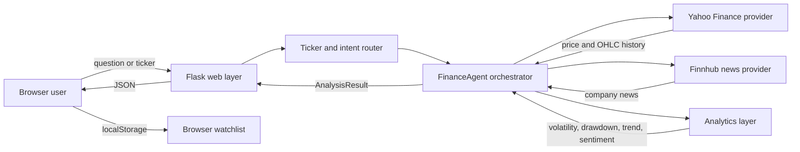

# Architecture

## System overview

The application uses a layered architecture so that user experience, orchestration,
analytics, and third-party data access can evolve independently.



## Request paths

### Natural-language analysis

```text
POST /analyze
  -> validate request
  -> extract ticker aliases and symbols
  -> classify intent
  -> select price, technical, comparison, news, or sentiment workflow
  -> call an injected provider
  -> calculate transparent metrics
  -> return a concise answer
```

### Dashboard data

```text
GET /api/dashboard/<ticker>
  -> validate ticker
  -> fetch latest and six-month market data
  -> calculate 20-day trend, annualized volatility, and maximum drawdown
  -> return chart-ready JSON
  -> render metric cards and canvas chart in the browser
```

## Layers and ownership

| Layer | Files | Responsibility |
|---|---|---|
| Web/API | `app.py`, `templates/index.html` | HTTP validation, JSON responses, dashboard UI |
| Orchestration | `src/finance_agent/agent.py` | Chooses and combines analysis workflows |
| Routing | `src/finance_agent/routing.py` | English/Chinese aliases, ticker extraction, intent rules |
| Analytics | `src/finance_agent/analytics.py` | Deterministic risk and sentiment calculations |
| Providers | `src/finance_agent/providers.py` | Isolates Yahoo Finance and Finnhub integrations |
| Contracts | `src/finance_agent/models.py` | Typed inputs and result objects |
| Verification | `tests/` | Offline provider, routing, API, and UI smoke tests |

## Design decisions

1. **Dependency injection:** `FinanceAgent` accepts market-data and news providers.
   Tests therefore run without network access, and providers can be replaced later.
2. **Deterministic analytics:** financial metrics are ordinary Python calculations;
   an LLM is not allowed to invent prices, volatility, or drawdown values.
3. **Optional credentials:** price workflows work without secrets. Finnhub news is
   enabled only when `FINNHUB_API_KEY` exists in the environment.
4. **Dual output:** human-readable answers serve the chat experience while
   structured dashboard JSON supports charts and future clients.
5. **Client-side watchlist:** watchlist state stays in `localStorage`; the server
   stores no personal portfolio information.

## Runtime topology

The current project runs locally as a stateless Flask application. Each request
fetches the data it needs from the selected provider. A future hosted version
could add caching, rate limiting, observability, and a durable user-account or
watchlist service without changing the analysis layer.
